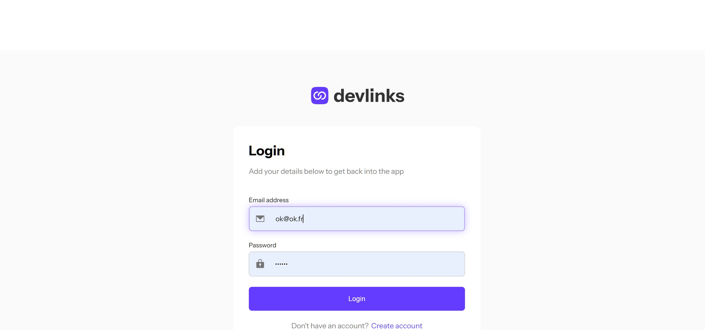
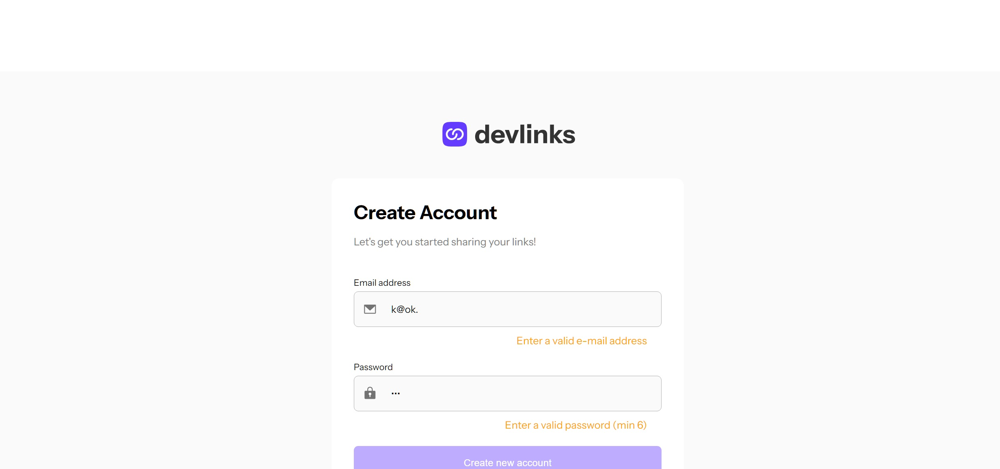
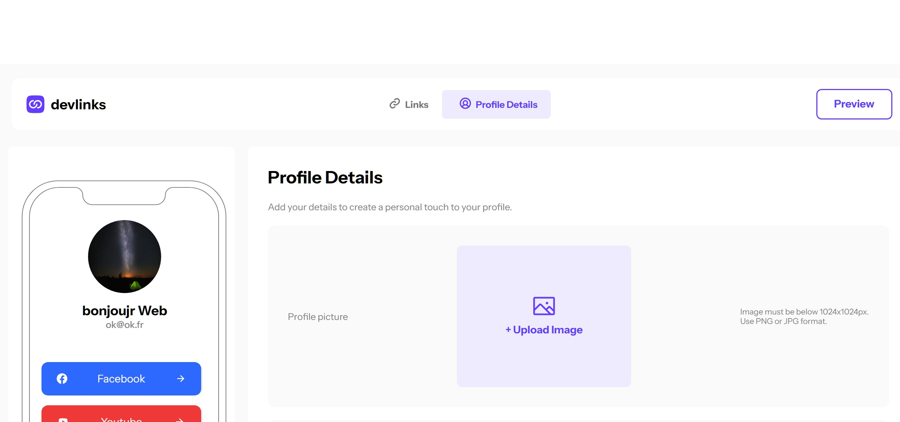
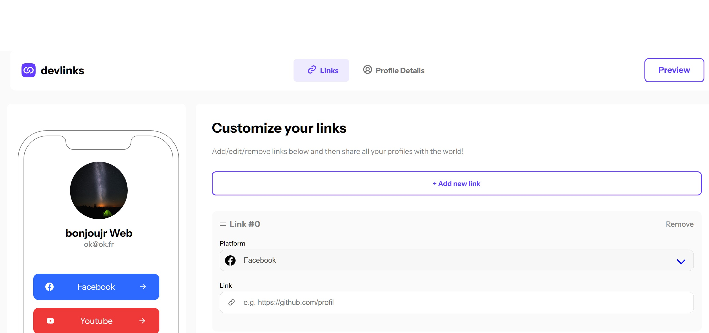
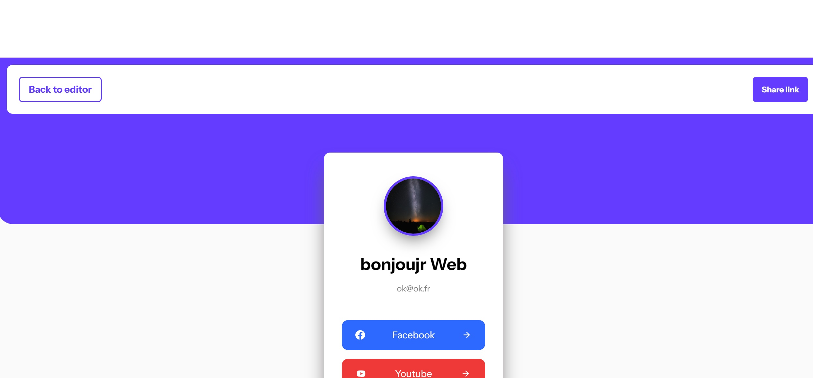
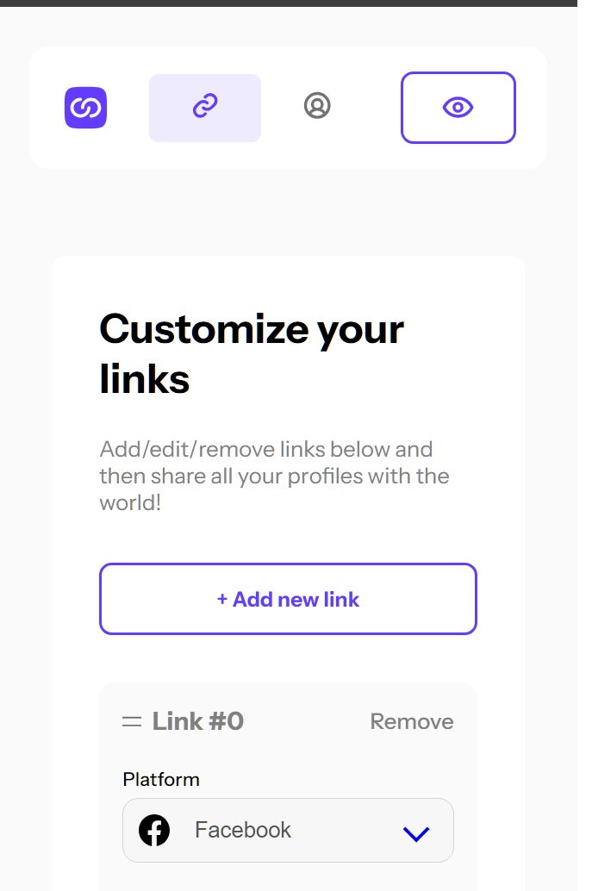

# Frontend Mentor - Link-sharing app solution

This is a solution to the [Link-sharing app challenge on Frontend Mentor](https://www.frontendmentor.io/challenges/linksharing-app-Fbt7yweGsT). Frontend Mentor challenges help you improve your coding skills by building realistic projects. 

### The challenge

Users should be able to:

- Create, read, update, delete links and see previews in the mobile mockup
- Receive validations if the links form is submitted without a URL or with the wrong URL pattern for the platform
- Drag and drop links to reorder them
- Add profile details like profile picture, first name, last name, and email
- Receive validations if the profile details form is saved with no first or last name
- Preview their devlinks profile and copy the link to their clipboard
- View the optimal layout for the interface depending on their device's screen size
- See hover and focus states for all interactive elements on the page
- **Bonus**: Save details to a database (build the project as a full-stack app)
- **Bonus**: Create an account and log in (add user authentication to the full-stack app)

### Screenshot

### Links

- Solution URL: [Github-Source](https://github.com/SdevWeb7/ChallengeLinks)
- Live Site URL: Don't have sorry
- 

## My process

  I done controllers with symfony and consume the api with react. And my own scss.

### Built with

- Semantic HTML5 markup
- CSS custom properties
- Flexbox
- [React](https://reactjs.org/) - JS library
- [Symfony](https://symfony.com/) - PHP Framework

### What I learned

  I learned a lot of things like use svg in ReactComponent, and synchronize the backend and the frontend.

## Author

- Website - [Sdevweb.com](https://sdevweb.com)
- Frontend Mentor - [@Veustyle](https://www.frontendmentor.io/profile/Veustyle)
- Github - [SdevWeb7](https://github.com/SdevWeb7)
